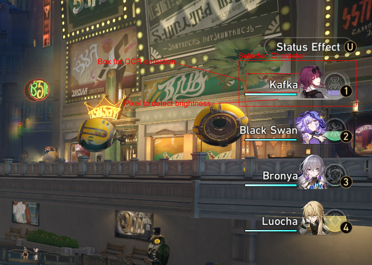
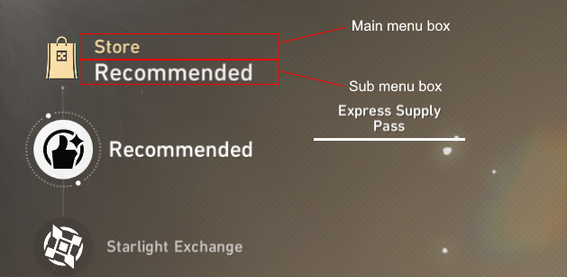
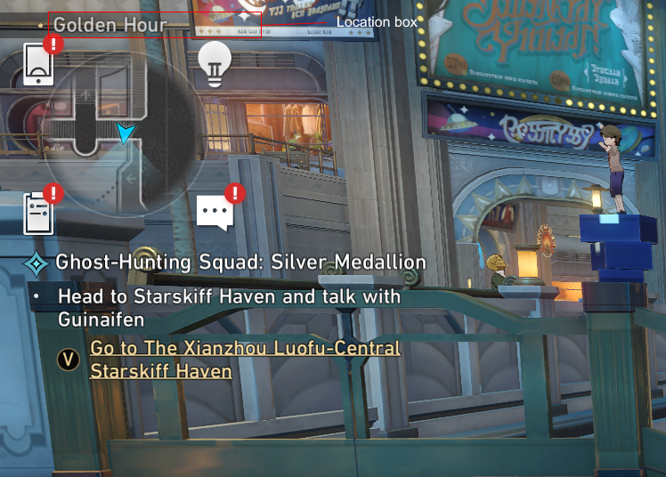
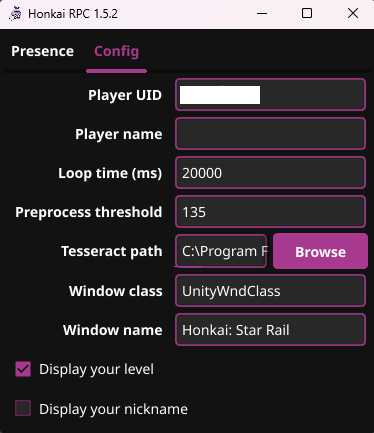
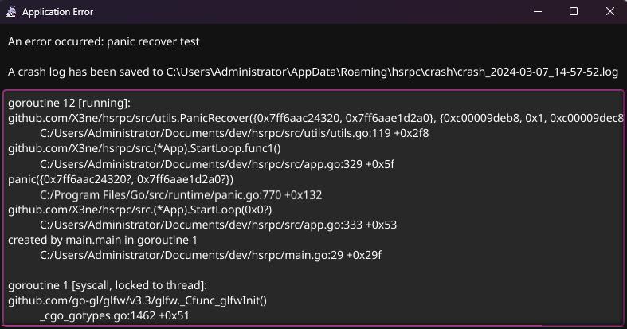
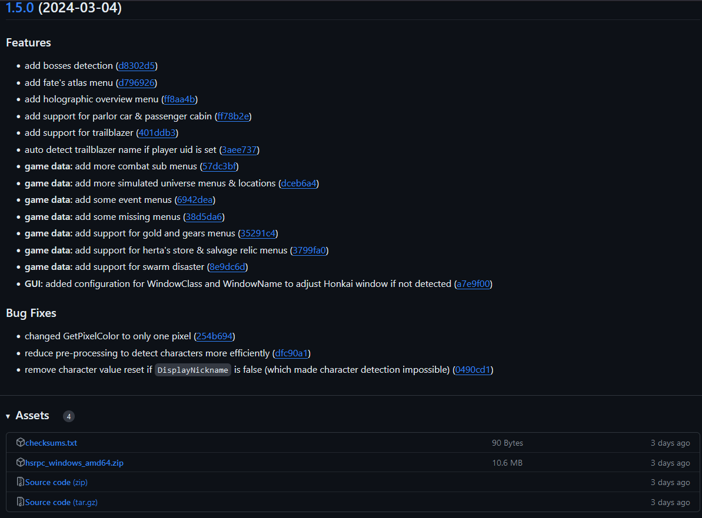

This project is my most advanced Go project. My goal was to create the easiest-to-use application to add Discord RPC features to the game Honkai Star Rail.
I started this project by researching the best way to get the game's data without risking being banned. Unfortunately, the hoyoverse public API was a bit too limited for my needs. So I decided to use Tesseract OCR to read game data from screenshots. 2 years ago, I had
started a similar project to add some RPC functionality to the Overwatch game (with a bit of machine learning), so I already had some experience with Discord RPC and OCR.

<br/>
# Project starts

After creating my go project, my first step was to take screenshots of my window via the windows api. My first attempt was a bit complicated. I wanted to be able to take screenshots of my windows using a window manager (HWND). So I found a go wrapper for the windows api called `w32`. With this package, I can
find my game window by the window class and window title and then create a function to take a screenshot of the game window.

```go
func WindowScreenshot(hWnd w32.HWND, rect *Rect) (*image.RGBA, error) {
	winRect := w32.GetWindowRect(hWnd)
	if rect != nil {
		winRect.Right = winRect.Left + rect.Width
		winRect.Bottom = winRect.Top + rect.Height
	}
	width := winRect.Right - winRect.Left
	height := winRect.Bottom - winRect.Top
	hdc := w32.GetDC(hWnd)
	if hdc == 0 {
    return nil, fmt.Errorf("failed to get device context: %v", w32.GetLastError())
	}
	defer w32.ReleaseDC(hWnd, hdc)
	dcDest := w32.CreateCompatibleDC(hdc)
	if dcDest == 0 {
    return nil, fmt.Errorf("failed to create compatible device context: %v", w32.GetLastError())
	}
	defer w32.DeleteDC(dcDest)
	hBitmap := w32.CreateCompatibleBitmap(hdc, int(width), int(height))
	if hBitmap == 0 {
    return nil, fmt.Errorf("failed to create compatible bitmap: %v", w32.GetLastError())
	}
	defer w32.DeleteObject(w32.HGDIOBJ(hBitmap))
	hOld := w32.SelectObject(dcDest, w32.HGDIOBJ(hBitmap))
	if hOld == 0 {
    return nil, fmt.Errorf("failed to select object: %v", w32.GetLastError())
	}
	defer w32.SelectObject(dcDest, hOld)
	if !w32.BitBlt(dcDest, 0, 0, int(width), int(height), hdc, int(rect.X), int(rect.Y), w32.SRCCOPY) {
    return nil, fmt.Errorf("failed to BitBlt: %v", w32.GetLastError())
	}
	bitmapInfo := w32.BITMAPINFO{
    BmiHeader: w32.BITMAPINFOHEADER{
      BiSize:          uint32(unsafe.Sizeof(w32.BITMAPINFOHEADER{})),
      BiPlanes:        1,
      BiBitCount:      32,
      BiWidth:         width,
      BiHeight:        -height,
      BiCompression:   w32.BI_RGB,
      BiSizeImage:     uint32(width * height * 4),
    },
	}
	pixels := make([]byte, width*height*4)
	if 0 == w32.GetDIBits(hdc, hBitmap, 0, uint(height), unsafe.Pointer(&pixels[0]), &bitmapInfo, w32.DIB_RGB_COLORS) {
    return nil, fmt.Errorf("failed to get DIBits: %v", w32.GetLastError())
	}
	img := image.NewRGBA(image.Rect(0, 0, int(width), int(height)))
	for y := 0; y < int(height); y++ {
    for x := 0; x < int(width); x++ {
      offset := (y*int(width) + x) * 4
      img.SetRGBA(x, y, color.RGBA{R: pixels[offset+2], G: pixels[offset+1], B: pixels[offset], A: 255})
    }
	}
	return img, nil
}
```

As you can see, this function is a bit complicated but... strangely, it works on other applications but not on Honkai Star Rail.
I can get an image of the game but after that the game window is just the same image in a loop. So after debugging for a while, my only solution was to
to take a screen shot and not just the game window. Now that this part is over, I can move on to the next step.

<br/>
# Tesseract ocr

At the very beginning of development, I encountered problems with [tesseract-ocr](https://github.com/tesseract-ocr/tesseract). I found a Go package named [goserract](https://github.com/otiai10/gosseract) to wrap tesseract.
Unfortunately, installing this package [gave me problems](https://github.com/otiai10/gosseract/issues/272).
So in my 42 projects I remembered a project called `minishell`. This project consisted in recreating `bash` in C.
In that project, we used a function called `execve` to execute a binary, so I decided to adopt the same approach for this project.
All I need to do is install the `tesseract` command with `choco` (I chose to develop this project under Windows for maximum compatibility).
I then used the `os/exec` package to execute the `tesseract` command. It was a great success and I was able to read the text of my screenshots.
But some of the results weren't up to my expectations, so I did some research and discovered that I could improve the results by setting a whitelist of characters I wanted to read.
After that, the results were much better, but not perfect.
So I came up with the idea of creating a utility that would take the game data (character names, locations, etc.) and create a function to find the best result for the ocr text.
And yes, the idea was good and the results were much better.

<br/>
# Selected character

In the game, you can have a team of 4 characters displayed on the right of the screen. I wanted the selected character to be displayed in the Discord status.
I found that the only thing that changes when you select a character is the small white background behind the character.
My idea was to take a pixel inside the four character slots and calculate the brightness of the pixel.
If the brightness is above a certain threshold, this means that the character is selected.
This technique works well, but the results aren't perfect: the box is a little transparent, so sometimes if the background is
too bright (e.g. when there's snow in the background), the pixel will be too bright and the algorithm will take the wrong character (the threshold value is a good way of mitigating this behavior).
Since I can obtain the position of the selected character, I was able to take a screenshot of the character area and then OCR the text to obtain the character's name. All that remains is to
display the character's icon and name in the Discord presence state.



<br/>
# Location & game menus

For the location and menus, it's pretty easy, the text is always displayed at the top left of the screen, so all I have to do is take a screenshot of this area, then perform my OCR logic and update the discord status.






<br/>
# GUI App

To easily configure my application, I wanted a graphical interface. To be able to more easily integrate my application with linux or macOS later on I chose to use [fyne](https://github.com/fyne-io/fyne), a UI toolkit and an app api that supports cross-platform.



My application integrates automatic updates, an automatic theme based on Windows color and crash reports to facilitate both development and the user experience once the first installation is complete.



<br/>
# Ci/Cd

I wanted to automate the release/buid/changelog of my application. As a first step, I used release-please to automatically create a pull request and a changelog with the changes made with each push on the git.
My workflow is pretty simple, I just need a personal access token to be able to create a pull request to my repo. My workflow looks like this:

```yaml
on:
  push:
    branches:
      - main

permissions:
  contents: write
  pull-requests: write

name: release-please

jobs:
  release-please:
    runs-on: ubuntu-latest
    steps:
      - uses: google-github-actions/release-please-action@v4
        with:
          token: ${{ secrets.PAT }}
          release-type: simple
```

To automatically build my application, I used goreleaser. This file is a little more complicated because I need to prepare the environment to be able to build my application for windows.
As I'm executing my workflow on a linux machine, I need to install `mingw-w64` to be able to build my application for windows. I also need to install `go-winres` to be able to add an icon to my application.
After my app is built, I need to attach the binary to the release previously created by release-please.
Here is my workflow:

```yaml
name: Build and Release

on:
  release:
    types:
      - published

permissions:
  contents: write

jobs:
  build-and-release:
    runs-on: ubuntu-latest

    steps:
    - name: Checkout code
      uses: actions/checkout@v4
      with:
        fetch-depth: 0

    - name: Set up Go
      uses: actions/setup-go@v4
      with:
        go-version: '1.22'

    - name: Install go-winres
      run: go install github.com/tc-hib/go-winres@latest

    - name: Get latest Git tag
      id: get_version
      run: echo "VERSION=$(git describe --tags --abbrev=0)" >> $GITHUB_ENV

    - name: Install MinGW-w64
      run: sudo apt-get install -y gcc-mingw-w64

    - name: Run GoReleaser
      uses: goreleaser/goreleaser-action@v5
      with:
        distribution: goreleaser
        version: latest
        args: release --clean
      env:
        GITHUB_TOKEN: ${{ secrets.PAT }}
```



And that's it, my application is now automatically built and released when I close the release-please pull request.

<br/>
# More coming soon

For now `hsrpc` is in version 1.5.2 and I'm still working on it. You can find the project on [github](https://github.com/X3ne/hsrpc)
