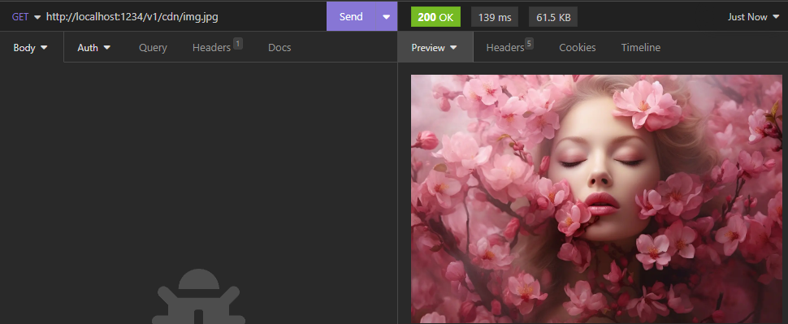
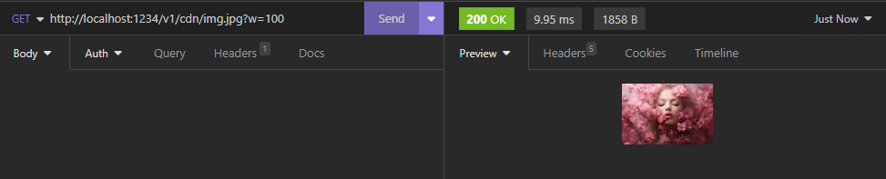
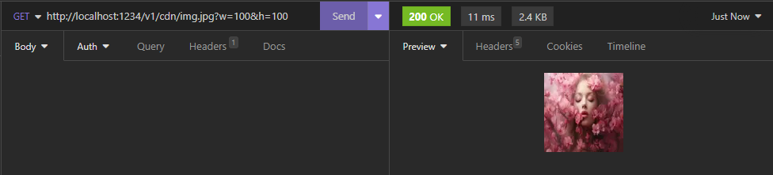
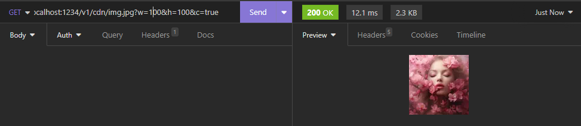
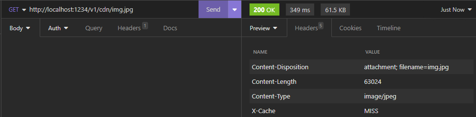
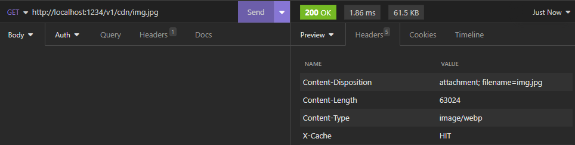
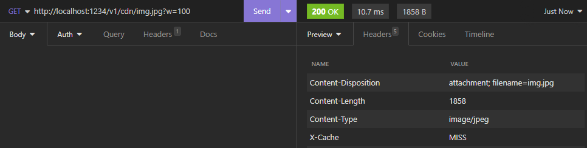
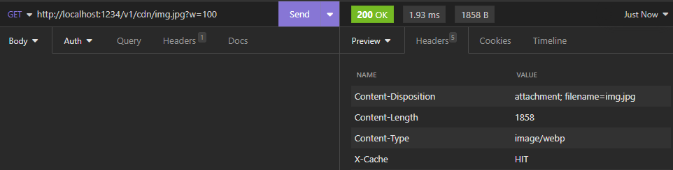

Go has always appealed to me because of its simplicity and efficiency. Coming from Javascript/Typescript,
I was looking for a typed, robust and high-performance language to write my apis. For this first project,
I wanted to port a service from one of my projects, with the simple aim of serving and manipulating images via an api.
For this project, I chose [Echo](https://echo.labstack.com/) as the framework for my api. Echo seems to be the simplest,
most modern and most appreciated REST framework in the Go community. After several tutorials and best practices,
I've got an Echo server up and running, ready to serve my images. The server integrates a versioning and documentation
system for the api thanks to OpenApi/Swagger (and [Swag](https://github.com/swaggo/swag) for integration with Go) so if you go to `{host}/v1/docs/index.html`
you'll come across the specification for v1 of the api (which is very basic given that the aim was rather to explore Go and its ecosystem).

<br />

# Image manipulation

For image manipulation, I chose to use [bimg](https://github.com/h2non/bimg), a wrapper for the [libvips](https://www.libvips.org/) library.
With this I can easily retrieve the url parameters as described by my `BimgResource` object.

```go
type RessourceBimg struct {
  Q int   `query:"q" validate:"optional" example:"?q=50" description:"Quality of the image" minimum:"1" maximum:"100"`
  A bool  `query:"a" validate:"optional" example:"?a=true" description:"Animated image" enum:"true,false"`
  C bool  `query:"c" validate:"optional" example:"?c=true" description:"Crop image" enum:"true,false"`
  W int   `query:"w" validate:"optional" example:"?w=100" description:"Width of the image" minimum:"1"`
  H int   `query:"h" validate:"optional" example:"?h=100" description:"Height of the image" minimum:"1"`
}
```

*First api call no params*

<br />


*Second api call with width changed*

<br />


*Third api call with width and height changed*

<br />


*Fourth api call with crop*

<br />

# Caching

To cache my images I've decided to use redis. So I store the key of my request with its associated buffer
and then send this buffer directly to the next request without going through the modification stage again.


*First api call no params, cache miss*

<br />


*Second api call no params, cache hit*

<br />


*First api call width params, cache miss*

<br />


*Second api call with params, cache hit*

<br />

Above, for the first unmodified image, we can see that the request took `349 ms` to complete, while the second took only `1.89 ms`.
The same scenario can be observed for the 2nd test with a modification of the image size using the `?width=100` parameter.
The cache system seems to be working perfectly.

<br />

# Conclusion

Although this project was very basic, it enabled me to explore the Go universe, its specifics, advantages and constraints.
It's a language I really like for its simplicity, performance, goroutines and readability.
Compared to my old TypeScript service, this one is a few ms faster in delivering my images.
