# Introduction
 
The latest project from 42 (school), transcendence is a web project that aims to create
a real-time web application. For this project, my team and I have chosen a modern front-end stack
(NestJs being mandatory for the back-end). Vue allows us to bring the reactivity
the project needs to be pleasant to use.

 

# Auth

For our authentication, we chose to use sessions rather than a standard jwt.
This enabled us to have a robust authentication system that was quick to implement,
without having to manage the validation and refreshment of tokens. We chose the
`passport` and `cookie-session` packages. Passport allows us to easily manage
sessions and Oauth2 with 42 and cookie-session allows us to create
cookies secured by our private key to authenticate the client to the server.

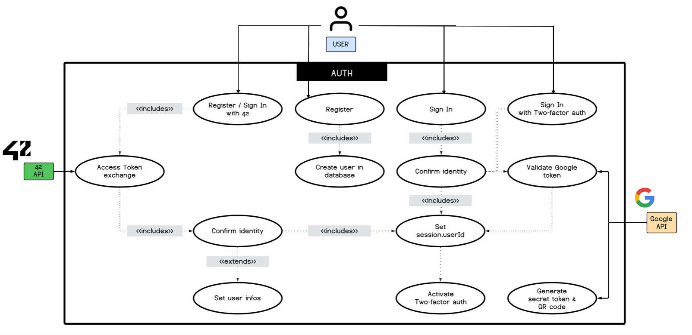

# Social

The social part (adding friends, chatting, blocking people, invitations...)
was a big part of the project. For this part, we opted for maximum reactivity thanks to socket.io.
Most client/server interactions are done in http and server/client communication for each event is handled by our sockets,
no need to refresh the page to receive invitations, messages and status updates, everything is in real time!

 

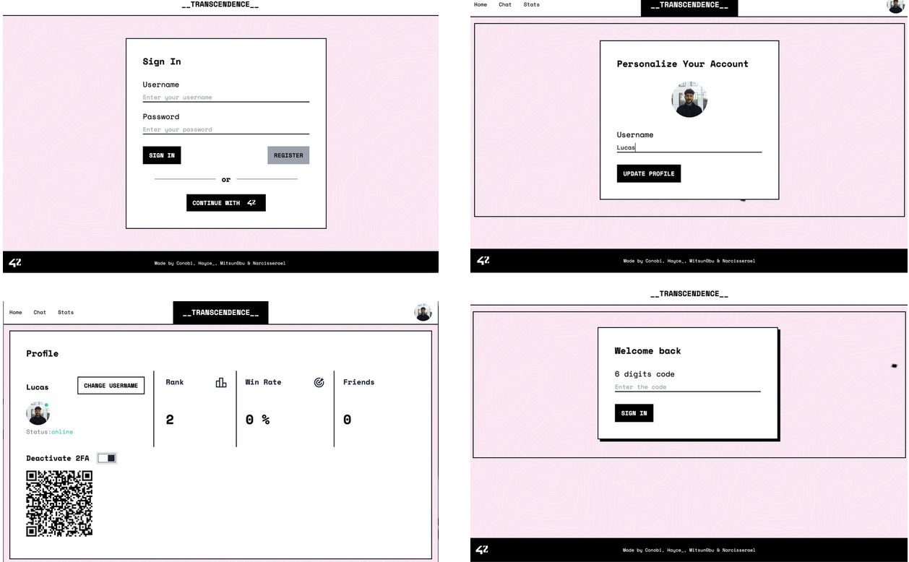

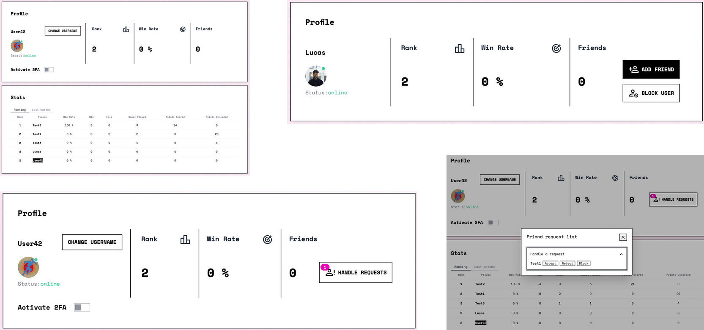

 

# Chat

Chat features include private messages and administrator-controlled groups. A user can create a chat group and
automatically become its owner, but can later add other administrators. Admin rights are limited to changing group
settings and moderating users (making them private with a password, banning users, silencing users or simply removing them from the group).

 

For party invitations, we've opted for an ingenious system that allows us to manage everything on the client side.
The invitation is in reality a simple link sent in the chat that allows us to parse the link, retrieve the game,
check that it's valid and then display the invitation component with a simple redirection to the game.

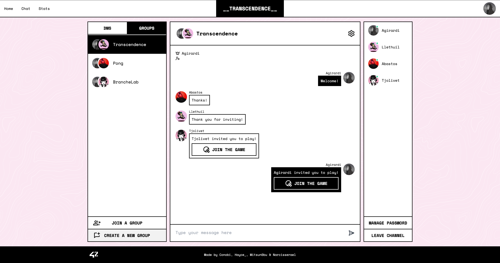

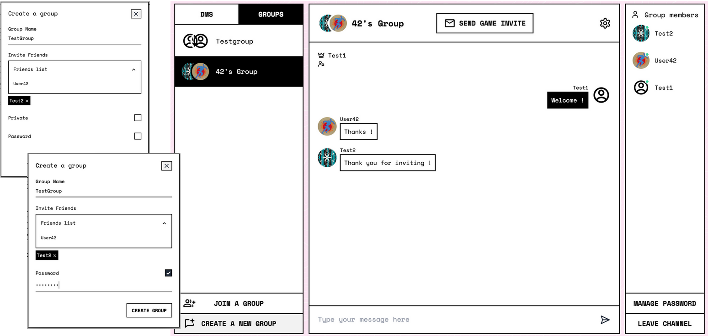

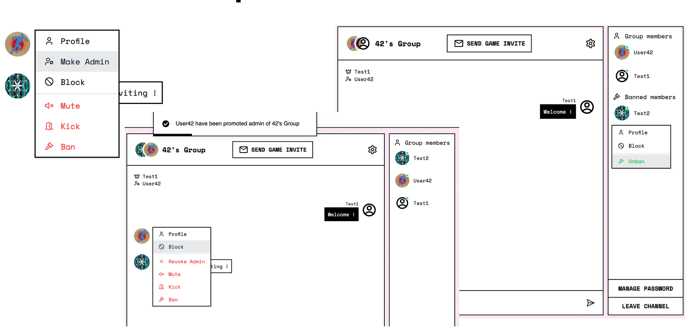

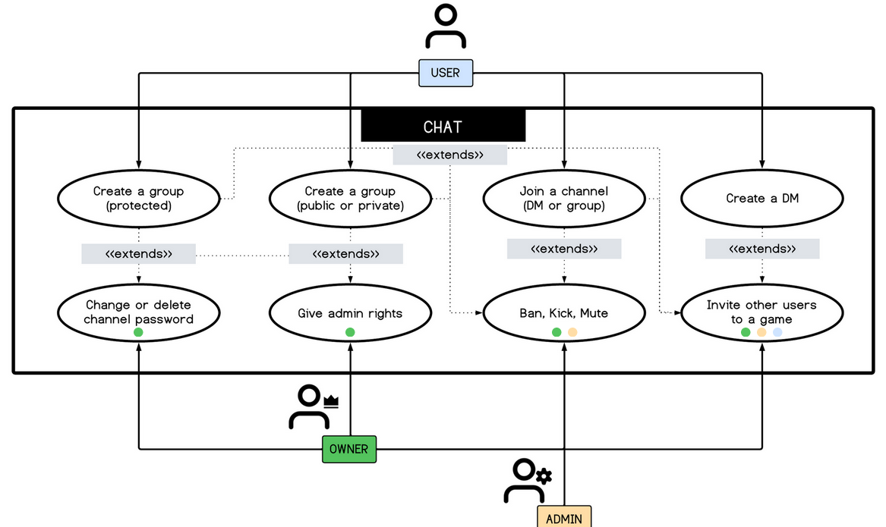

 

# Rooms and Matchmaking

The game itself is based on a room system. A user can create a room and change its parameters or join a public room displayed in the list.
All room-related events (a user joins, parameters are modified, etc.) are managed in real time via the room socket.

 

On the other hand, if the user chooses to join matchmaking,
the user joins a queue and looks for all public games looking for another person.
If no game is available, a room is created for the user, which then waits for another player.

 

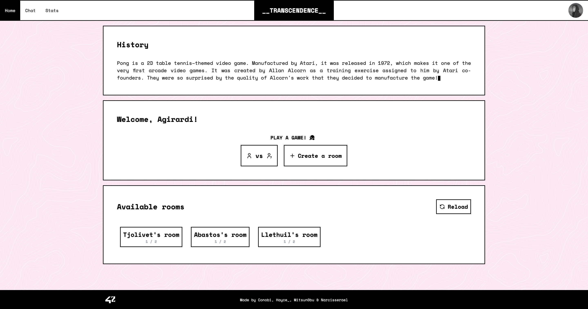

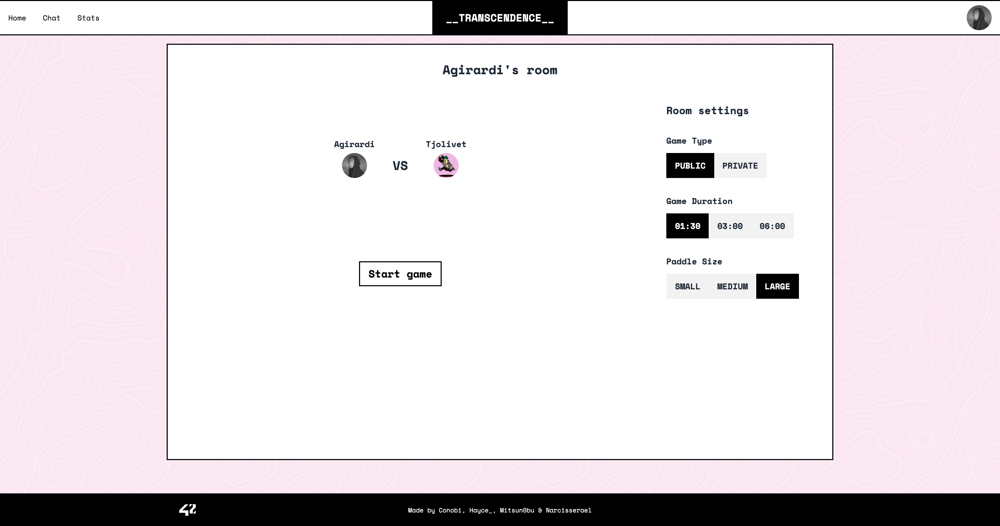

 

# Game

The game part is one of the only parts I didn't contribute to (in any way)
but our game is in 3d, which is pretty cool.

 

The user must move his paddle with the mouse, and all events are transmitted
via the game's socket to the server, which calculates the position of the paddles and ball
to prevent cheating. The state of the game is then broadcast to the clients in the room
(allowing us to easily manage spectators).

 

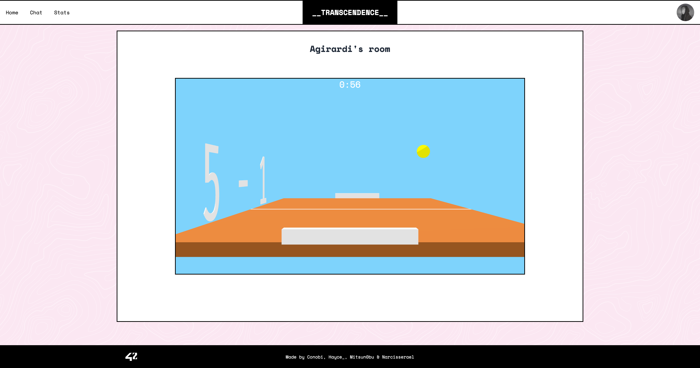

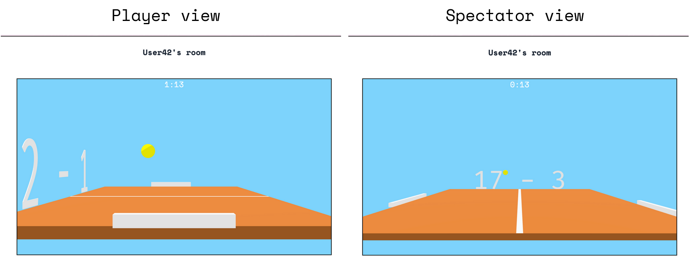

 

# Deployment

The deployment of our service is pretty basic, but I've nevertheless tried to make something production-ready.
Our service is split into 3 services: our frontend, our backend and our database. The database is simply a postgresql image,
while the other 2 services are our own images. For the images, I used a multistage build to create optimized docker images.

 

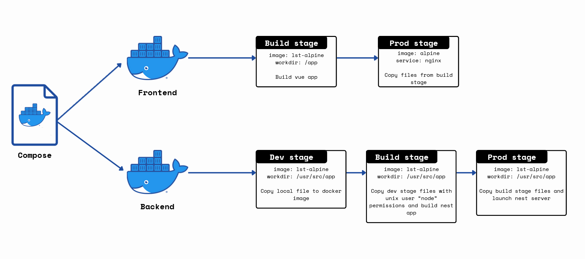

 

For the frontend, the vue application is built in a first stage and then the static files are copied and served with a `nginx` server.

 

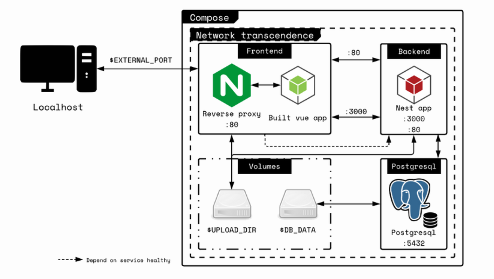

 
